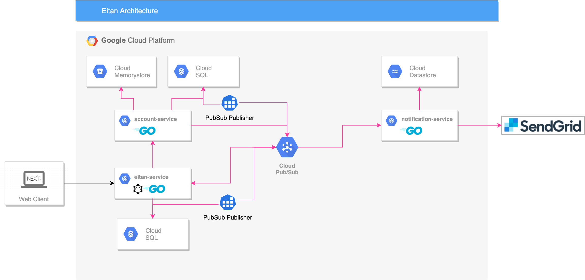

# eitan

## Architecture


## Setup
1. Install tools
```sh
$ make setup
```

2. Fill .env
``` 
$ cp .env.sample .env
$ vim .env
```

3. Add below hosts to `/etc/hosts`
```
127.0.0.1 account.local.eitan-flash.com
127.0.0.1 api.local.eitan-flash.com
127.0.0.1 local.eitan-flash.com
```

## Run servers
- Run local servers and DB on docker
```sh
$ make run
```

- Run everything on docker
```sh
$ make run-dc
```

## DB schema migration in local
1. Edit [schema file](./defs/sql/ddl)

2. Dry run migration
```sh
$ make db-migrate-dry
```

3. Apply migration
```sh
$ make db-migrate
```
※ `make db-migrate` will also regenerate Go models.
